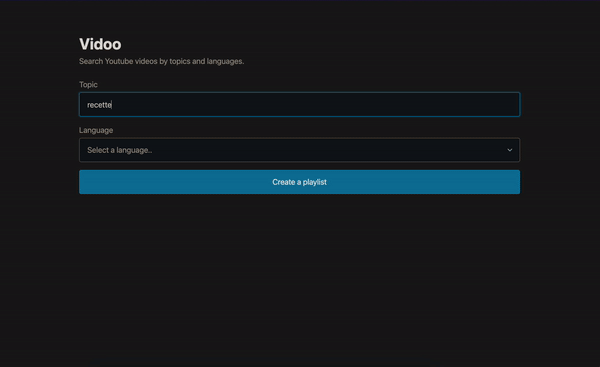

<br/>
<p align="center">
  <h3 align="center">Vidoo</h3>

  <p align="center">
    Make a Youtube playlist by topic and language.
    <br/>
    <br/>
  </p>
</p>


## Table Of Contents

* [About the Project](#about-the-project)
* [Built With](#built-with)
* [Getting Started](#getting-started)
  * [Prerequisites](#prerequisites)
  * [Installation](#installation)
* [Authors](#authors)

## About The Project



This project allows you to easily create Youtube playlists on a specific subject and language.


## Built With

- AdonisJS
- bing-translate-api
- @yimura/scraper
- PicoCSS

## Getting Started


### Prerequisites

* npm

```sh
npm install npm@latest -g
```

### Installation

1. Clone the repo

```sh
git clone https://github.com/thomasbrq/vidoo.git
```

2. Install NPM packages

```sh
npm install
```

3. Create a .env file

```JS
PORT=3333
HOST=0.0.0.0
NODE_ENV=development
APP_KEY=<key>
DRIVE_DISK=local
SESSION_DRIVER=cookie
CACHE_VIEWS=false
```

4. Run in development mode
```sh
npm run dev
```

## Authors

* [ThomasBrq](https://github.com/thomasbrq)
